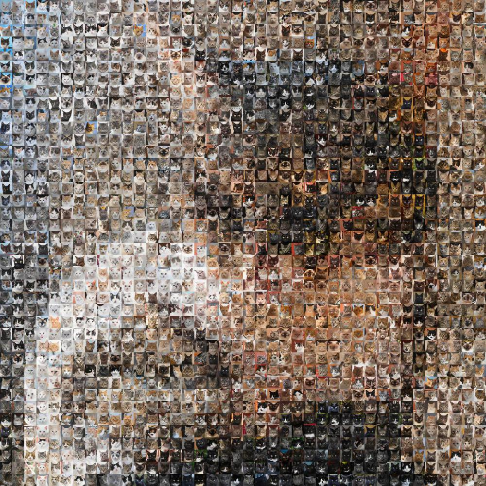

# Photo Mosaic
Create a photo mosaic from other photos!

## Usage
- Step 1: Install the requirements

```sh
pip install -r requirements/local.txt
```

- Step 2: Create a directory in the folder `photos`
- Step 3: Fill this directory with photos with the same aspect ratio
- Step 4: Update the source directory name and original photo filepath in `mosaic_creator.py`. The defaults are the `cats` directory in `photos` as source directory, and `wolf_high_res.jpg` in `testdata` as original photo.
- Step 5: Run the module `mosaic_creator.py`

```sh
python -m mosaic_creator
```

## Example




## TODOs
- [ ] Enforce all assumptions
- [ ] Add proper error handling
- [ ] Add an argument parser for input and output to screen/file of choice
- [ ] Create an example with more source photos
